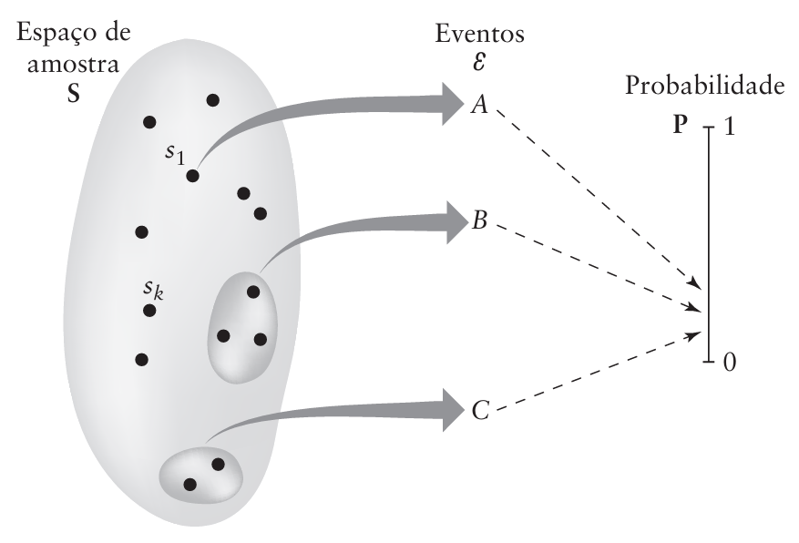
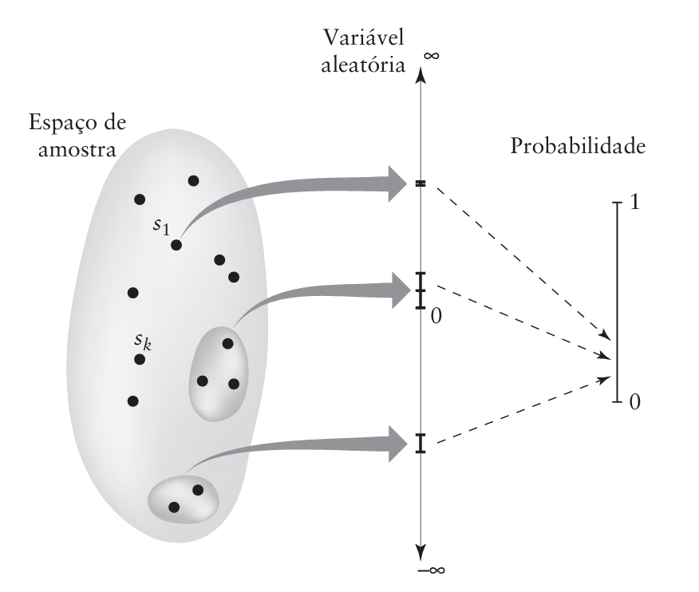
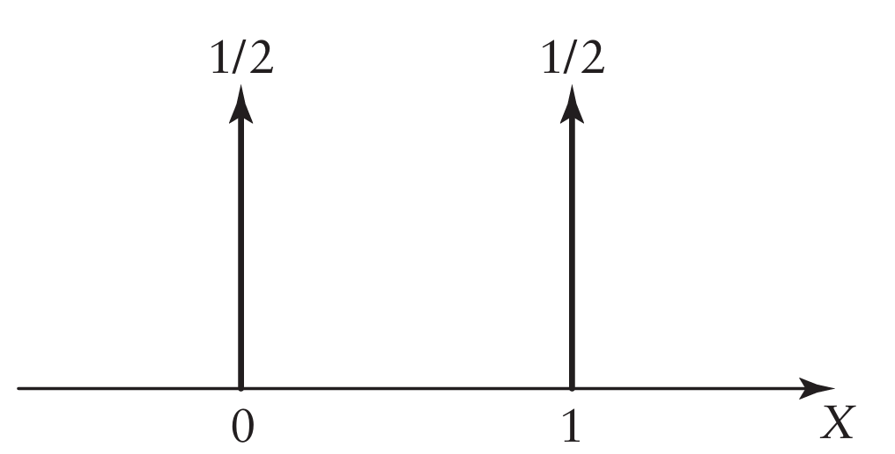

```{r setup, include=FALSE}
knitr::opts_chunk$set(echo = TRUE)
library(reticulate)
```

<p ALIGN=justify>A teoria da probabilidade é uma ferramenta matemática crucial para modelar e analisar situações envolvendo a incerteza inerente a experimentos aleatórios. Em um experimento de natureza aleatória, a saída é imprevisível em cada tentativa individual, sendo influenciada por fenômenos imprevisíveis. Por exemplo, ao lançar uma moeda, as possíveis saídas são "cara" ou "coroa", e a incerteza reside na impossibilidade de antecipar o resultado antes do lançamento.</p>

<p ALIGN=justify>Esses experimentos de natureza aleatória apresentam duas propriedades fundamentais. Em primeiro lugar, a saída é imprevisível em qualquer tentativa do experimento. Isso destaca a natureza aleatória do processo. Em segundo lugar, para uma grande quantidade de tentativas, a saída exibe uma regularidade estatística. Apesar da incerteza individual, a teoria da probabilidade se concentra em padrões que emergem quando o experimento é repetido várias vezes.</p>

<p ALIGN=justify>A imprevisibilidade é uma característica essencial dos fenômenos aleatórios, onde fatores desconhecidos influenciam os resultados. No entanto, a teoria da probabilidade permite lidar com essa incerteza, fornecendo ferramentas para quantificar e entender a probabilidade de diferentes resultados. Cada tentativa do experimento é única, mas ao realizar o experimento muitas vezes, padrões estatísticos começam a se manifestar.</p>

<p ALIGN=justify>Além do lançamento de moedas, a teoria da probabilidade é aplicada em uma variedade de contextos, como estatística, ciência dos dados, teoria das filas e análise de riscos financeiros. Em estatística, por exemplo, a teoria da probabilidade é fundamental para inferência estatística, onde os resultados de amostras são usados para fazer afirmações sobre uma população maior. Em essência, a teoria da probabilidade oferece uma estrutura matemática poderosa para lidar com a incerteza e modelar o comportamento de sistemas complexos sujeitos a variações imprevisíveis.</p>

<p ALIGN=justify>Dizemos que um experimento aleatório possui as seguintes propriedades:</p>

1. Em qualquer tentativa do experimento, a saída é imprevisível.

2. Para uma grande quantidade de tentativas, a saída exibe uma regularidade estatística. Ou seja, um padrão médio definido de saída é observado se o experimento é repetido 
um grande número de vezes.

<p ALIGN=justify>No código 1, listado logo abaixo, apresentamos um evento aleatório: o clássico arremesso de moeda. Neste cenário, podemos observar a existência da possibilidade da moeda cair com a face voltada para cima, representada pelas opções "cara" ou "coroa", em um único arremesso. Entretanto, ao realizar múltiplos arremessos, torna-se possível identificar uma tendência na frequência de ocorrência desses valores.</p>

<p ALIGN=justify>Ao analisarmos a execução do código, percebemos que a aleatoriedade do arremesso de moeda se manifesta na variabilidade dos resultados obtidos. Cada lançamento individual apresenta uma probabilidade equitativa de resultar em "cara" ou "coroa", representando um evento probabilístico básico.</p>

<p ALIGN=justify>Ao realizar diversos arremessos, podemos notar que a distribuição de ocorrências de "cara" e "coroa" tende a se equilibrar conforme aumentamos o número de experimentos. Isso está alinhado com as expectativas teóricas de probabilidade, onde a convergência para uma distribuição uniforme se torna mais evidente à medida que a amostra aumenta.</p>

<p ALIGN=justify>É importante ressaltar que, embora cada arremesso individual seja imprevisível, a análise estatística de múltiplos arremessos nos permite identificar padrões emergentes e compreender a influência da aleatoriedade na frequência de ocorrência dos resultados. Essa abordagem é fundamental em contextos mais amplos, como simulações computacionais, estudos de probabilidade e análises estatísticas, onde a compreensão da variabilidade é crucial para interpretações significativas.</p>

```{python, fig.align='center', fig.width=6, fig.height=5}
# Código 1: Evento aleatório de múltiplos lançamentos de uma mesma moeda
# Este código simula a ocorrência de caras e coroas em múltiplos lançamentos de uma moeda e plota as frequências relativas.

import random
import matplotlib.pyplot as plt

def lancar_moeda(n):
    caras = 0
    coroas = 0

    for _ in range(n):
        resultado = random.randint(0, 1)
        if resultado == 0:
            caras += 1
        else:
            coroas += 1

    frequencia_relativa_caras = (caras / n) * 100
    frequencia_relativa_coroas = (coroas / n) * 100

    return frequencia_relativa_caras, frequencia_relativa_coroas

def plotar_frequencia_relativa(numeros_lancamentos):
    frequencias_caras = []
    frequencias_coroas = []

    for n_lancamentos in numeros_lancamentos:
        frequencia_caras, frequencia_coroas = lancar_moeda(n_lancamentos)
        frequencias_caras.append(frequencia_caras)
        frequencias_coroas.append(frequencia_coroas)
    
    plt.figure(figsize=(10,5))
    plt.plot(numeros_lancamentos, frequencias_caras, label='Cara', marker='o')
    plt.plot(numeros_lancamentos, frequencias_coroas, label='Coroa', marker='o')

    plt.xlabel('Número de Lançamentos')
    plt.ylabel('Frequência Relativa (%)')  # Modificação aqui
    plt.title('Figura 1: Incidência do Número de caras e coroas em múltiplos lançamentos de uma moeda')
    plt.legend()

    # Adição do código para incluir o símbolo de percentagem no eixo Y
    plt.yticks(range(0, 101, 10), [f'{i}%' for i in range(0, 101, 10)])

    plt.grid(True)
    plt.show()

if __name__ == "__main__":
    numeros_lancamentos = [5, 100, 300, 500, 800, 1000, 2000, 3000, 5000, 6000, 7000]
    plotar_frequencia_relativa(numeros_lancamentos)
```

## Abordagem em Frequência Relativa


<p ALIGN=justify>Para elaborar o conceito de regularidade estatística, seja o evento A uma possível saída de um experimento aleatório. Por exemplo, no experimento de lançar uma moeda, o evento A pode representar “cara”. Suponha que em n tentativas do experimento, o evento A ocorre $n_A$ vezes. Podemos, então, associar a relação 8.1 ao evento A. Esta relação é chamada de freqüência relativa do evento A. Claramente, a freqüência relativa é um número real não 
negativo menor ou igual a um.</p>

<p ALIGN=justify>Sendo que a frequência relativa representa uma parte do conjunto de possibilidade em termos percentuais de 100% ou 1, sendo assim temos que:</p>

$$0<\frac{n_a}{n}<1 \tag{8.1}$$

<p ALIGN=justify>possibilidades do espaço amostral. Dizemos que o experimento exibe regularidade estatística se, para qualquer sequência de "n" tentativas, a frequência relativa $\frac{n_a}{n}$ converge para um limite quando "n" se torna grande, como é o caso mostrado no código 1 de multiplos lançamentos de moedas, podemos observar que a frequência tende a valores percentuais de 50%. Definimos este limite.</p>

$$P[a] = \lim_{n \to \infty}  \left(\frac{n_a}{n}\right) \tag{8.2}$$

<p ALIGN=justify>Outra definição importante para o estudo de eventos aleatórios é o espaço amostral "S" aonde dentro desse espaço amostral temos a ocorrencia de eventos que nada mais são que subconjuntos de "S". Podemos considerar o caso de um lançamento de dados, sendo que o mesmo tem 6 faces numeradas de 1 a 6, se considerarmos um número de lançamentos n, teremos que a ocorrência de aparecer o numero 1 é um evento, assim como 2, 3,4 ,5 e 6. A definição de evento também esta relacionada a uma regra, como por exemplo, somente numeros pares, sendo asssim teriamos como eventos o numero 2, 4 e 6.</p>

<p ALIGN=justify>No código 2 é apresentado um experimento que simula múltiplos lançamentos de um dado. Esse experimento permite observar a frequência com que cada valor do dado aparece ao longo de várias iterações. Ao realizar a simulação várias vezes, torna-se evidente a aleatoriedade associada aos dados, uma vez que a distribuição dos resultados tende a se aproximar da distribuição de probabilidade teórica do dado.</p>

<p ALIGN=justify>Este tipo de simulação é útil para compreender o comportamento estatístico de eventos aleatórios, como os lançamentos de um dado. A visualização gráfica, por meio do histograma gerado, facilita a análise das tendências e padrões nos resultados, fornecendo insights sobre a probabilidade de ocorrência de cada face do dado.</p>

```{python, fig.align='center', fig.width=6, fig.height=5}
# Código 2: Evento aleatório de múltiplos lançamentos de um dado

import random
import matplotlib.pyplot as plt
from collections import Counter

def simular_lancamento_dado(N):
    resultados = [random.randint(1, 6) for _ in range(N)]
    return resultados

def plotar_grafico(resultados):
    contagem = Counter(resultados)
    valores, frequencias = zip(*contagem.items())

    fig, ax = plt.subplots()

    cores = ['red', 'blue', 'green', 'purple', 'orange', 'gray']

    for i, (valor, freq) in enumerate(zip(valores, frequencias)):
        ax.bar(valor, freq, color=cores[i % len(cores)], align='center', alpha=0.7, label=f'Valor {valor}')

    ax.set_xlabel('Valor do Dado')
    ax.set_ylabel('Frequência')
    ax.set_title(f'Figura 2: Simulação de Lançamento de Dado ({len(resultados)} lançamentos)', pad=20)

    # Adiciona o número total de lançamentos
    ax.text(0.5, 0.9, f'Total de lançamentos: {len(resultados)}', transform=ax.transAxes, ha='center')

    ax.legend(loc='upper right', bbox_to_anchor=(1.15, 1))

    plt.tight_layout()
    plt.show()

# Defina o número de lançamentos (N)
N = 1000

# Simule o lançamento do dado
resultados = simular_lancamento_dado(N)

# Plote o gráfico com legendas
plotar_grafico(resultados)
```

## Axiomas da Probabilidade

<p ALIGN=justify>Quando executamos um experimento aleatório, é natural termos a consciência das várias saídas que podem aparecer. Neste contexto, é conveniente pensarmos no experimento e suas possíveis saídas como a definição de um espaço e de seus pontos. Para cada possível valor de saída do experimento, associamos um ponto chamado de ponto de amostra, o qual representamos por $s_k$. A totalidade de todos os pontos de amostra, correspondendo à união de todas as possíveis saídas de um experimento, é chamada de espaço de amostra, a qual representamos por $S$. Um evento corresponde a um único ponto de amostra ou a um conjunto de pontos. Em particular, o espaço de amostra $S$ total é chamado de evento certeza, e o conjunto nulo $\emptyset$ é chamado de evento nulo ou impossível. Um único ponto de amostra é chamado de evento elementar.</p>

<p ALIGN=justify>Considere, por exemplo, um experimento envolvendo o lançamento de um dado. Neste experimento, existem seis possíveis saídas: um, dois, três, quatro, cinco ou seis pontos na face superior do dado. Associando um ponto de amostra a cada uma destas seis possíveis saídas, temos um espaço de amostra que consiste de seus pontos de amostra.</p>

<p ALIGN=justify>De amostra $s$. Por outro lado, o evento descrevendo a afirmativa “um número par de pontos mostrados” corresponde ao subconjunto $\{2, 4, 6\}$ do espaço de amostra. Note que o termo “evento” é utilizado para descrever o subconjunto ou a afirmativa.</p>

<p ALIGN=justify>Agora estamos prontos para fazer uma definição formal de probabilidade. Um sistema de probabilidade consiste de:/p>

1. O espaço de amostra $S$ de eventos elementares (ou saídas).

2. Uma classe $\varepsilon$ de eventos que são subconjuntos de $S$.

3. Uma medida de probabilidade $P[A]$ associada a cada evento $A$ da classe $\varepsilon$, a qual possui as seguintes propriedades: (i) $\mathrm{P}[\mathrm{S}]=1$, (ii) $0 \leq \mathrm{P}[\mathrm{A}] \leq 1$, (iii) Se $A \cup B$ é a união de dois eventos mutuamente exclusivos da classe $\varepsilon$, então:
  
$$
\mathbf{P}[A \cup B]=\mathbf{P}[A]+\mathbf{P}[B] \tag{8.3}
$$

<p ALIGN=justify> As Propriedades (i), (ii) e (iii) são chamadas de axiomas da probabilidade. O axioma (i) afirma que a probabilidade de um evento certo é um. O axioma (ii) afirma que a probabilidade de um evento é um número não negativo menor ou igual a um. O axioma (iii) afirma que a probabilidade da união de dois eventos mutuamente exclusivos é a soma das probabilidades dos eventos individuais.</p>

<p ALIGN=justify> Apesar da abordagem por axiomas para a teoria de probabilidade ser de natureza abstrata, todas os três axiomas possuem interpretações de frequência relativa. O axioma (ii) corresponde à Equação 8.1. O axioma (i) corresponde ao caso limiteda Equação 8.1 quando o evento $A$ ocorre em todas as tentativas. Para interpretar o axioma (iii) notamos que se o evento $A$ ocorre $n_A$ vezes em $n$ tentativas e o evento $B$ ocorre $n_B$ vezes, então a união do evento “$A$ ou $B$” ocorre em $n_A + n_B$ tentativas (desde que $A$ e $B$ nunca ocorram na mesma tentativa). Logo, $n_{A \cup B} = n_A + n_B$, e, portanto, temos:</p>

$$\frac{n_{A \cup B}}{n}=\frac{n_A}{n}+\frac{n_B}{n} \tag{8.4}$$

<p ALIGN=justify>Na Figura 8.2, observa-se a representação do espaço amostral \(S\), no qual um evento está associado a um ou mais valores de $S$. O evento $\epsilon$ denota uma possibilidade de ocorrência dentro desse espaço amostral. É importante destacar que a probabilidade da ocorrência de um evento específico está sempre compreendida entre 0 e 1, expressa em termos percentuais.</p>

<figure>

<center></center>

<center>

<figcaption><br>Figura 8.2 - Ilustração da relação entre espaço de amostra, eventos e probabilidade.<br><br></figcaption>

</center>

</figure>

## Variável Aleatória 

<p ALIGN=justify>Embora o significado das saídas de um experimento aleatório seja evidente, essas saídas geralmente não são as representações mais adequadas para uma análise matemática aprofundada. Um exemplo clássico disso é observado ao lançar uma moeda, onde as opções "cara" ou "coroa" não proporcionam uma representação matemática conveniente. Da mesma forma, em experimentos nos quais retiramos bolas coloridas de uma urna, a cor em si não é facilmente analisável matematicamente.</p>

<p ALIGN=justify>Em tais situações, é comum adotar uma abordagem mais conveniente associando números ou intervalos de valores às saídas do experimento aleatório. Por exemplo, podemos atribuir o valor 1 a "cara" e 0 a "coroa". Essa prática é formalmente denominada variável aleatória, que descreve o processo de associar um número a uma saída específica de um experimento aleatório.</p>

<p ALIGN=justify>Ao expandirmos essa ideia, percebemos que o uso de variáveis aleatórias proporciona uma estrutura matemática mais robusta para analisar e compreender eventos aleatórios. Elas nos permitem aplicar métodos estatísticos e probabilísticos de maneira mais eficiente, estabelecendo uma ponte entre o mundo dos fenômenos aleatórios e a rigidez da análise matemática. Assim, ao invés de lidar com conceitos abstratos como "cara" ou "coroa", podemos trabalhar com valores numéricos que facilitam a aplicação de ferramentas matemáticas mais avançadas, tornando o processo de análise mais preciso e elucidativo.</p>

<p ALIGN=justify>Em termos gerais, uma função cujo domínio pertence a um espaço de amostra e cuja imagem é um conjunto de números reais é denominada variável aleatória do experimento. De maneira mais precisa, para eventos no conjunto ε, uma variável aleatória associa um subconjunto da reta real. Portanto, se a saída de um experimento é representada por $s$, podemos denotar a variável aleatória como $X(s)$ ou simplesmente $X$. É importante observar que, apesar de ser comumente chamada de variável aleatória por questões históricas, $X$ é, na verdade, uma função.</p>

<p ALIGN=justify>Ao representar uma saída específica de um experimento aleatório como $x$, expressamos isso como $X(s_k) = x$, onde $s_k$ é uma instância específica do espaço de amostra. Vale ressaltar que pode haver mais de uma variável aleatória associada ao mesmo experimento aleatório, cada uma fornecendo uma perspectiva única sobre os resultados possíveis.</p>

<p ALIGN=justify>Para ilustrar de forma mais concreta, considere o exemplo em que retiramos bolas coloridas de uma urna. Se $s$ representa uma determinada sequência de retiradas, então $X(s)$ pode ser a quantidade total de bolas vermelhas obtidas. Nesse contexto, $X$ é a variável aleatória que associa a cada sequência de retiradas um valor numérico correspondente à contagem de bolas vermelhas. Essa abordagem fornece uma estrutura matemática eficiente para analisar e compreender a variabilidade dos resultados de um experimento aleatório.</p>

<p ALIGN=justify>O conceito de variável aleatória é ilustrado na Figura 8.3, na qual suprimimos os eventos mas mostramos os subconjuntos do espaço de amostra sendo mapeados diretamente a um subconjunto da linha real. A função de probabilidade se aplica a esta variável aleatória exatamente da mesma forma que ela se aplicaria aos eventos internos.</p>

<figure>

<center></center>

<center>

<figcaption><br>Figura 8.3 - Ilustração da relação entre espaço de amostra, variáveis aleatórias e probabilidade.<br><br></figcaption>

</center>

</figure>

$$\mathbf{P}[X=x]= \begin{cases}\frac{1}{2}, & x=0 \\ \frac{1}{2}, & x=1 \\ 0, & \text { caso contrário }\end{cases} \tag{8.5}$$

<p ALIGN=justify>Esta função de probabilidade de massa é ilustrada na Figura 8.4, na qual funções delta de peso 0,5 são utilizadas para representar a probabilidade de massa de cada um dos pontos, 0 e 1.</p>

<figure>

<center></center>

<center>

<figcaption><br>Figura 8.4 - Ilustração da função de probabilidade de massa para o experimento de lançamento de moeda.<br><br></figcaption>

</center>

</figure>

### Exemplo 8.1 Variável Aleatória de Bernoulli

<p ALIGN=justify> O experimento de lançamento de moeda na qual a probabilidade de sair cara é $p$. Seja $X$ a variável aleatória que assume o valor $0$ se for coroa e $1$ se for cara. Dizemos que $X$ é uma variável aleatória de Bernoulli. A função de probabilidade de massa de uma variável aleatória de Bernoulli é:</p>

$$\mathbf{P}[X=x]= \begin{cases}1-p, & x=0 \\ p, & x=1 \\ 0, & \text { caso contrário }\end{cases}$$

<p ALIGN=justify>A distribuição de Bernoulli é discreta em termos de espaço amostral {0, 1}, que tem valor 1 com a probabilidade de sucesso 
$p$ e valor 0 com a probabilidade de falha $q = 1-P$, tal exemplo pode ser descrito de forma simbólica conforme mostra o código 3.</p>

```{python}

# Código 3

from sympy import symbols, Eq, solve

# Definindo variáveis simbólicas
p, q = symbols('p q')

# Definindo a função de massa de probabilidade para a distribuição de Bernoulli
pmf_bernulli = {1: p, 0: q}

# Verificando se a soma das probabilidades é igual a 1
eq = Eq(sum(pmf_bernulli.values()), 1)

# Resolvendo a equação para encontrar q em termos de p
sol = solve(eq, q)[0]

# Imprimindo o resultado
print(f"A probabilidade de fracasso (q) em termos de p é: {sol}")

```

<p ALIGN=justify>No gráfico gerado no código 4, cada subplot representa uma distribuição específica, enquanto as barras indicam as probabilidades associadas a cada valor possível.</p>

<p ALIGN=justify>As probabilidades escolhidas (0.2, 0.4, 0.6, 0.8) exemplificam como diferentes valores de $p$ influenciam a forma da distribuição. A barra associada ao valor 1 representa a probabilidade de sucesso, enquanto a barra associada ao valor 0 representa a probabilidade de fracasso. A altura das barras reflete as respectivas probabilidades.</p>

<p ALIGN=justify>Claro, aqui está a explicação em LaTeX:</p>

<p ALIGN=justify>A Função de Massa de Probabilidade (PMF) de Bernoulli é expressa como:</p>

$$ P(X = k) = p^k \cdot (1 - p)^{1 - k} $$

<p ALIGN=justify>onde $X$ é a variável aleatória que representa o resultado do experimento, $k$ é o valor possível (0 ou 1), e $p$ é a probabilidade de sucesso.</p>

<p ALIGN=justify>Portanto, ao observar o gráfico, estamos visualizando como as probabilidades de sucesso $P(X = 1)$ e fracasso $P(X = 0)$ se distribuem para diferentes valores possíveis de $k$. Isso proporciona uma compreensão intuitiva de como a variação da probabilidade de sucesso $p$ afeta a forma da distribuição de Bernoulli.</p>


```{python}
# Código 4 

import matplotlib.pyplot as plt
import numpy as np
from scipy.stats import bernoulli

# Probabilidades de sucesso
probabilidades = [0.2, 0.4, 0.6, 0.8]

# Valores possíveis (0 e 1)
valores = [0, 1]

# Cores diferentes para cada gráfico
cores = ['blue', 'red', 'green', 'yellow']

# Configuração do gráfico com 2x2 subplots
fig, axs = plt.subplots(2, 2, figsize=(10, 8))

# Itera sobre as probabilidades e os subplots
for p, cor, ax in zip(probabilidades, cores, axs.flatten()):
    # Calcula a PMF para cada valor possível
    pmf = bernoulli.pmf(valores, p)

    # Plota o gráfico de barras com cores diferentes
    bars = ax.bar(valores, pmf, alpha=0.7, color=cor)
    for bar, label in zip(bars, pmf):
        yval = bar.get_height()
        ax.text(bar.get_x() + bar.get_width() / 2, yval, f'{label:.2f}', ha='center', va='bottom', color='black')

    # Adiciona título e rótulos aos eixos
    ax.set_title(f'Distribuição de Bernoulli para p = {p}')
    ax.set_xlabel('Valor')
    ax.set_ylabel('Probabilidade')

# Ajusta o layout para evitar sobreposição
plt.tight_layout()

# Exibe o gráfico
plt.show()

```

## Funções de Distribuição

<p ALIGN=justify>Muito relacionada com a função de probabilidade de massa está a função de probabilidade de distribuição. Ela é a probabilidade da variável aleatória $X$ assumir qualquer valor menor ou igual a $x$. A função de distribuição é escrita como $F_{X}(x)$ tal que: </p>

$$F_X(x)=\mathbf{P}[X \leq x] \tag{8.7}$$

<p ALIGN=justify>A função $F_{X}(x)$ é uma função de $x$, não da variável aleatória $X$. Entretanto, ela depende da associação da variável aleatória $X$, representada pelo uso de $X$ como subscrito. Para qualquer ponto $x$, a função de distribuição expressa a probabilidade do valor de $X$ ser menor do que $x$. A função de distribuição possui duas propriedades básicas sendo elas:</p>

1. A função de distribuição $F_{X}(x)$ é limitada entre zero e um.

2. A função de distribuição $F_{X}(x)$ é uma função monotônica não decrescente de x, ou seja:

$$F_X\left(x_1\right) \leq F_X\left(x_2\right) \quad se \quad x_1 \leq x_2$$

<p ALIGN=justify>Se X é uma variável aleatória de valor contínuo e $F_{X}(x)$ é diferenciável com respeito a $x$, então uma terceira função geralmente utilizada é a função de densidade de probabilidade, representada por $f_{X}(x)$,</p>

$$f_X(x)=\frac{\partial}{\partial x} F_X(x) \tag{8.8}$$

<p ALIGN=justify>A função densidade de probabilidade possui três propriedades básicas:</p>

1. Como a função de distribuição é monotônica não decrescente, a função de densidade é não negativa para todos os valores de x.

2. A função de distribuição pode ser recuperada da função de densidade pela integração, mostrado por,

$$F_X(x)=\int_{-\infty}^x f_X(s) ds \tag{8.9}$$

3. A Propriedade 2 implica em que a área total sob a curva da função de densidade seja unitária.

### Exemplo 8.2 Função de Distribuição de Bernoulli

<p ALIGN=justify>Vemos que a função de probabilidade de distribuição da variável aleatória de Bernoulli é dada por:</p>

 $$F_{X}(x) = \left\{\begin{matrix}
 0, & x < 0 \\ 
  1-p,& 0 \leq x < 1 \\
 1,& x \geq  1 \\ 
\end{matrix}\right.$$

### Exemplo 8.3 Distribuição Uniforme 

Considere uma variável aleatória X com função de densidade

 $$f_{X}(x) = \left\{\begin{matrix}
 \frac{1}{b-a}, & a \leq x \leq b \\ 
  0, & contrario \\
\end{matrix}\right.\tag{8.10}$$

<p ALIGN=justify>Esta função satisfaz as condições de densidade de probabilidade porque fX(x) ≥ 0, e a área sob a curva é unitária. A variável aleatória possuindo a função densidade de probabilidade da Eq. (8.10) é dita ser uniformemente distribuída.</p>

# Referências

[1] Silva, L.C *et al*. **Matemática Estatística e Probabilidade**, CAPES. Disponivel em : [eduCAPES](https://educapes.capes.gov.br/bitstream/capes/554261/2/Livro%20Estatistica%20e%20Probabilidade%20.pdf)

[2] Documentação da biblioteca [Scipy.static](https://docs.scipy.org/doc/scipy/reference/stats.html)

[3] Documentação da biblioteca [Sympy](https://docs.sympy.org/latest/index.html)

[4] Documentação da biblioteca [Numpy](https://numpy.org/doc/)

# [Volta a Página Inicial 🏠](Página-Inicial.html)

