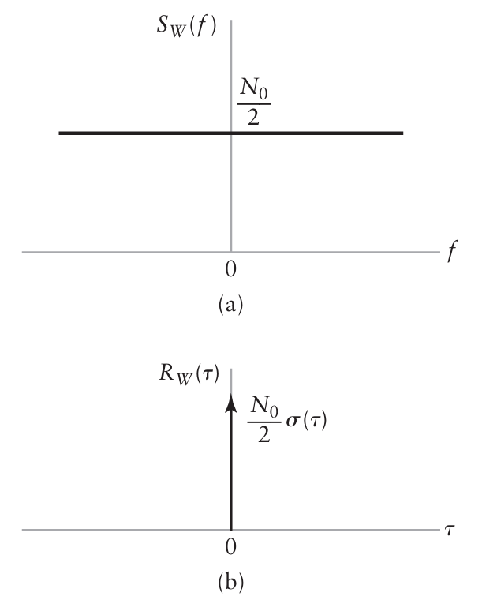

```{r setup, include=FALSE}
knitr::opts_chunk$set(echo = TRUE)
library(reticulate)
```

<p ALIGN=justify>A análise de ruído em sistemas de comunicação é geralmente baseada em um processo de ruído idealizado, chamado de ruído branco. A densidade espectral de potência do ruído branco é independente da frequência. O ruído branco é análogo ao termo “luz branca” no sentido de que todas as componentes de frequência estão presentes em quantidade iguais.Representamos a densidade espectral de potência $W(t)$ de um processo de ruído branco por:</p>

$$S_W(f)=\frac{N_0}{2}\tag{8.92}$$

<p ALIGN=justify>Na qual o fator $\frac{1}{2}$ foi incluído para indicar que metade da potência é associada com as frequências positivas e metade com as freqüências negativas, como ilustrado na Figura 8.18(a). A dimensão de $N_0$ é watts por hertz. O parâmetro $N_0$ é geralmente medido no estágio de entrada de um receptor de comunicação. Como não existe função delta na origem na densidade espectral de potência da Figura 8.18(a), o ruído branco não possui potência CC. Ou seja, 
sua esperança ou valor médio é nulo.</p>

<p ALIGN=justify>Como a função de autocorrelação é a transformada inversa de Fourrier da densidade espectral de potência, temos que, da Equação (8.92), a autocorrelação do ruído branco é dada por:</p>

$$R_W(\tau)=\frac{N_0}{2}\delta(\tau)\tag{8.93}$$

<p ALIGN=justify>A função de autocorrelação do ruído branco consiste de uma função delta ponderada pelo fator $N_0/2$ localizado em $\tau=0$, tal como na Figura 8.18(b). Observamos que $R_W(\tau)$ é zero para $\tau \neq 0$. Consequentemente, quaisquer duas amostras diferentes do ruído branco, não importa quão perto elas estejam no tempo, são não correlacionadas.</p>

<p ALIGN=justify>Estritamente falando, o ruído branco possui potência média infinita e, desta forma, não é fisicamente realizável. Entretanto, o ruído branco possui propriedades matemáticas convenientes sendo, portanto, útil na análise de sistemas. A utilização do processo de ruído branco é análoga à da função impulso ou função delta na análise de sistemas lineares. O efeito do impulso é observado apenas após ele ter passado através de um sistema com largura de faixa finita. De forma semelhante, o efeito do ruído branco é observado apenas após a sua passagem através de um sistema com largura de faixa finita. Podemos, pois, afirmar que enquanto a largura de faixa do processo de ruído na entrada de um sistema é 
apreciavelmente maior do que a do próprio sistema, podemos modelar o processo de ruído por um ruído branco. Este geralmente é o caso em sistemas de comunicação práticos.</p>

<figure>

<center></center>

<center>

<figcaption><br>Figura 8.18 - Características do ruído branco. (a) Densidade espectral de potência. (b) Função de autocorrelação.<br><br></figcaption>

</center>

</figure>

# [Volta a Página Inicial 🏠](Página-Inicial.html)
