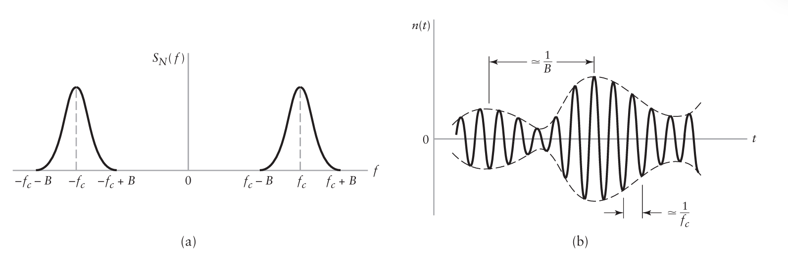
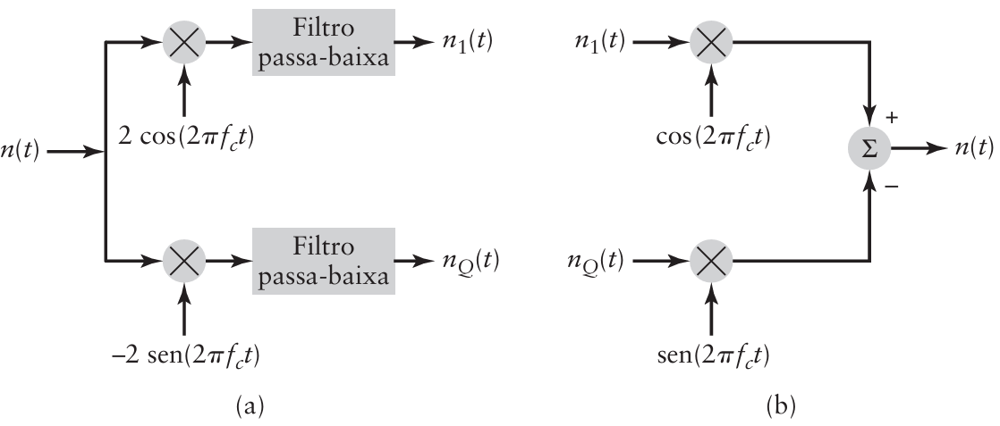
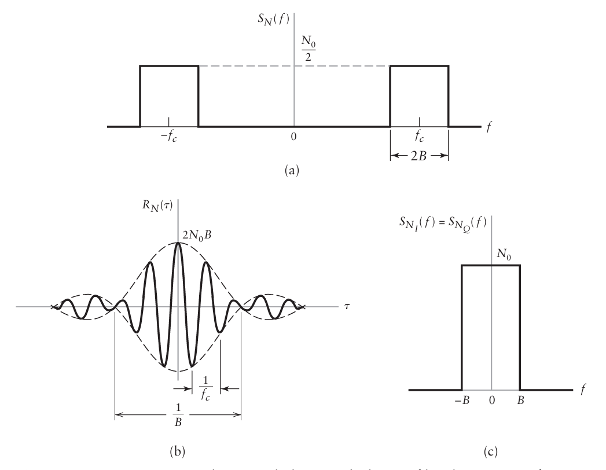
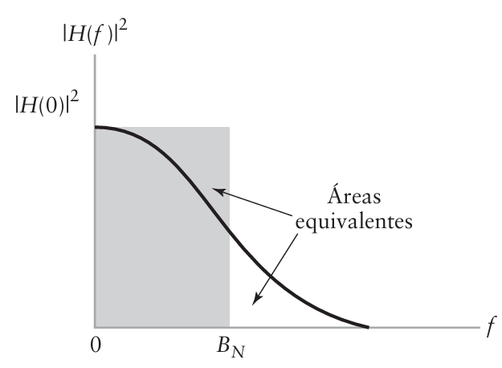
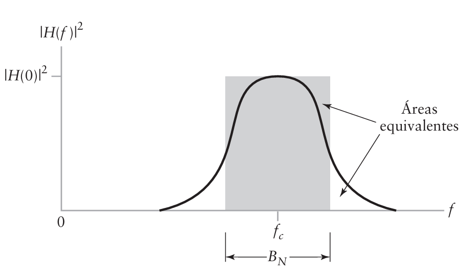

```{r setup, include=FALSE}
knitr::opts_chunk$set(echo = TRUE)
library(reticulate)
```

<p ALIGN=justify>Um receptor de comunicação inclui vários estágios de processamento de sinal. Um estágio comum de processamento de sinal para sistemas banda passante é um filtro de faixa estreita cuja largura de faixa é apenas larga o suficiente para passar a componente modulada do sinal recebido, essencialmente não distorcida, mas não grande o suficiente para admitir ruído excessivo para dentro do receptor. O processo de ruído que aparece na saída de tal filtro é 
chamado de ruído de faixa estreita. Se um ruído de faixa estreita possui espectro centrado nas freqüências de meia faixa $\pm f_c$, como ilustrado na Figura 8.21(a), vemos que uma função amostra do processo de ruído de faixa estreita é, de alguma forma, similar a forma de onda senoidal de frequência $f_c$ que varia lentamente em amplitude e fase, como ilustrado na Fig. 8.21(b).</p>

<figure>

<center></center>

<center>

<figcaption><br>Figura 8.21 - (a) Densidade espectral de potência de um ruído de faixa estreita. (b) Função amostra do ruído de faixa estreita.<br><br></figcaption>

</center>

</figure>
 
<p ALIGN=justify>O ruído de faixa estreita pode ser representado matematicamente utilizando componentes em fase e em quadratura, tal como as utilizamos para representar sinais de faixa estreita no Capítulo 2 e capítulos subsequentes. Para o processo de ruído de faixa estreita $N(t)$ de largura de faixa 2B e centrada na frequência $f_c$ da Figura 8.21, podemos representar $N(t)$ na forma:</p>

$$N(t)=N_I(t)\cos{(2\pi f_c t)}-N_Q(t)\sin{(2\pi f_c t)}\tag{8.97}$$

<p ALIGN=justify>Na qual $N_I(t)$ é chamada de componente em fase de $N(t)$ e $N_Q(t)$ é a componente em quadratura. Tanto $N_I(t)$ quanto $N_Q(t)$ são processos aleatórios passa-baixa. Ou seja, seus espectros são confinados a $0 < | f| < B$. O conhecimento das componentes em fase e quadratura, além da frequência central $f_c$, caracteriza completamente o ruído de faixa estreita.</p>

<figure>

<center></center>

<center>

<figcaption><br>Figura 8.22 - (a) Extração das componentes em fase e quadratura do processo de ruído de faixa estreita. (b) Geração do processo de ruído de faixa estreita de suas componentes em fase e  quadratura.<br><br></figcaption>

</center>

</figure>

<p ALIGN=justify>Dada a função amostra $n(t)$ do ruído de faixa estreita, as componentes em fase e quadratura podem ser extraídas utilizando o esquema mostrado na Figura 8.22(a). Os dois filtros passa-baixa são considerados como ideais com largura de faixa igual a B. Este esquema é obtido diretamente da representação de ruído de faixa estreita dado pela Equação (8.97). Alternativamente, se tivermos as componentes em fase e quadratura, podemos gerar o ruído de faixa estreita $n(t)$ utilizando a Figura 8.22(b).</p>

<p ALIGN=justify>As componentes em fase e quadratura do ruído de faixa estreita possuem as seguintes importantes propriedades:</p>

1. A componente em fase $N_I(t)$ e a componente em quadratura $N_Q (t)$ do ruído de faixa estreita $N(t)$ possuem média nula.
 
2. Se o ruído de faixa estreita $N(t)$ for Gaussiano, então suas componentes em fase e quadratura serão Gaussianas.

3. Se o ruído de faixa estreita $N(t)$ for estacionário, então suas componentes em fase e quadratura serão estacionárias.

4. Tanto a componente em fase $N_I (t)$ quanto em quadratura $N_Q (t)$ possuem a mesma densidade espectral de potência. Esta densidade espectral é relacionada com a densidade espectral de potência da densidade de faixa estreita $S_N (f)$ por:

\begin{equation*}
S_{N_I}(f)=S_{N_Q}(f)=\left\{
\begin{matrix}
S_N(f-f_c)+S_N(f+f_c), \quad & -B \leq f \leq B\\
0, \quad & \textrm{caso contrário}\tag{9.98}
\end{matrix}
\right.
\end{equation*}
 
5. A componente em fase $N_I(t)$ e a componente em quadratura $N_Q(t)$ possuem a mesma variância do ruído de faixa estreita $N(t)$. 

<p ALIGN=justify>Como ilustração destas propriedades, considere o ruído de faixa estreita com densidade espectral de potência mostrada na Figura 8.23(a). De acordo com a Propriedade 4, o espectro da componente em fase do ruído de faixa estreita é dado por:</p>

\begin{equation*}
S_{N_I}(f)=\left\{
\begin{matrix}
N_0, \quad & -B \leq f \leq B\\
0, \quad & \textrm{caso contrário}
\end{matrix}
\right.
\end{equation*}

<p ALIGN=justify>E a componente em quadratura possui espectro similar. Portanto, a densidade espectral da componente em fase é duas vezes a do ruído de faixa estreita. Entretanto, como o ruído de faixa estreita possui densidade espectral não nula em duas faixas de largura $2B$ centradas em $\pm f_c$, temos que:</p>
 
$$\int^{\infty}_{-\infty}S_N(f)\; df=\int^{\infty}_{-\infty}S_{N_I}(f) \; df=2N_0B$$ 

<figure>

<center></center>

<center>

<figcaption><br>Figura 8.23 - Características de um ruído branco idealmente filtrado por passa-faixa. (a) Densidade espectral de potência. (b) Função de autocorrelação. (c) Densidade espectral de potência das componentes em fase e quadratura.<br><br></figcaption>

</center>

</figure>

<p ALIGN=justify>A qual confirma a Propriedade 5 de que a componente em fase possui a mesma variância (potência) do ruído de faixa estreita.</p>

# Largura de faixa equivalente ao ruído

<p ALIGN=justify>Primeiro, o ruído branco filtrado possui potência média finita. Segundo, a potência média é proporcional à largura de faixa. Podemos generalizar estas observações para incluir todos os tipos de filtros passa-baixa, definindo a largura de faixa equivalente ao ruído, como mostrado a seguir.</p>

<p ALIGN=justify>Suponha que uma fonte de ruído branco com espectro $S_W (f) = N_0/2$ é conectada à entrada de um filtro arbitrário com função de transferência $H(f)$. Das Propriedades 1 e 4 da densidade espectral de potência, a potência média do ruído de saída é:</p>

\begin{align*}
P_N&=\int^{\infty}_{-\infty}|H(f)|^2S_W(f) \; df\\
&=\int^{\infty}_{-\infty}|H(f)|^2\frac{N_0}{2}\; df\\
&= N_0 \int^{\infty}_{0}|H(f)|^2 \; df \tag{8.102}
\end{align*}

<p ALIGN=justify>na qual, na última linha, utilizamos o fato da resposta em amplitude $|H(f)|$ ser uma função par da frequência. Considere, agora, a mesma fonte de ruído conectada à entrada de um filtro passa-baixa ideal com resposta e frequência zero $H(0)$ e largura de faixa $B_N$ como ilustrado pela Figura 8.24. Neste caso, a potência média do ruído de saída é:</p>

$$P_N = N_0 B_N |H(0)|^2 \tag{8.103}$$

<p ALIGN=justify>Igualando a Equação (8.102) e a Equação (8.103), determinamos a largura de faixa $B_N$ do filtro ideal que produz a mesma potência do filtro arbitrário. Fazendo isto, obtemos:</p>

$$B_N=\frac{\int^{\infty}_0|H(f)|^2\; df}{|H(0)|^2}\tag{8.104}$$

<p ALIGN=justify>A largura de faixa $B_N$ é chamada de largura de faixa equivalente ao ruído para um filtro passa-baixa. Portanto, o procedimento para o cálculo da largura de faixa equivalente ao ruído consiste em substituir o filtro passa-baixa arbitrário com função de transferência $H(f)$ por um filtro ideal passa-baixa equivalente com resposta em frequência zero $H(0)$ e largura de faixa $B_N$, como ilustrado na Figura 8.24.</p>

<figure>

<center></center>

<center>

<figcaption><br>Figura 8.24 - Ilustração de um filtro passa-baixa arbitrário $H(f)$ e um filtro passa-baixa ideal com largura de faixa $B_N$.<br><br></figcaption>

</center>

</figure>

<p ALIGN=justify>De maneira similar, podemos definir a largura de faixa equivalente ao ruído para um filtro passa-faixa, como ilustrado na Figura 8.25. Esta figura mostra somente a resposta em  amplitude quadrada do filtro para frequências positivas. Portanto, a largura de faixa equivalente ao ruído para um filtro passa-faixa pode ser definida por:</p>

<figure>

<center></center>

<center>

<figcaption><br>Figura 8.25 - Ilustração de um filtro passa-faixa arbitrário $H(f)$ e do filtro passa-faixa ideal com largura de faixa $B_N$.<br><br></figcaption>

</center>

</figure>

$$B_N=\frac{\int^{\infty}_0|H(f)|^2\; df}{|H(f_c)|^2}\tag{8.105}$$

<p ALIGN=justify>Na qual $|H(f_c)|^2$ é a resposta em amplitude de frequência central do filtro. De fato, observamos que a Equação (8.105) pode ser utilizada para representar os dois casos fazendo $f_c=0$ para filtros passa-baixa. Então, temos o resultado genérico:

$$P_N=N_0|H(f_c)|^2B_N \tag{8.106}$$

<p ALIGN=justify>E o efeito da passagem do ruído branco através do filtro pode ser separado em duas partes:</p>

>O ganho de potência de freqüência central $|H(f_c)|^2$.

>A largura de faixa B_N equivalente ao ruído, representando a seletividade em frequência do filtro.

<p ALIGN=justify>Esta separação se aplica se o filtro for passa-baixa ou passa-faixa. Logo, como regra geral, podemos dizer que o efeito do ruído no sistema é reduzido estreitando-se a largura de faixa do sistema.</p>

# [Volta a Página Inicial 🏠](Página-Inicial.html)