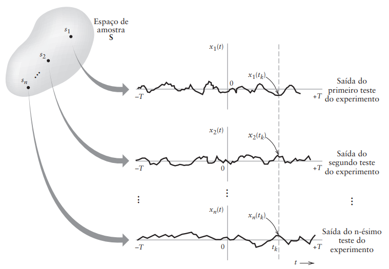

```{r setup, include=FALSE}
knitr::opts_chunk$set(echo = TRUE)
library(reticulate)
```

# Capítulo 8.6 - Processos Aleatórios

<p ALIGN=justify>Um processo aleatório $X(t)$ é um “ensemble” de funções no tempo com uma regra probabilística que relaciona uma probabilidade a um evento significativo associado com uma observação de uma destas funções.</p>

<p ALIGN=justify>Ele pode ser observado na análise estatística de sistemas de comunicações, onde temos a caracterização de sinais aleatórios, tais como: sinais de voz, TV, dados digitais e ruído elétrico.</p>

<p ALIGN=justify>Propriedades dos sinais aleatórios:</p>
1. São funções do tempo, definidas sobre um intervalo.
2. Antes de realizar o experimento, não é possível descrever com exatidão a forma de onda que vai ser observada.

<p ALIGN=justify>Portanto, na descrição de sinais aleatórios, cada ponto amostra do espaço amostral é função do tempo.</p>

<p ALIGN=justify >Considere um experimento aleatório especificado pela saída $s$ de um espaço amostral $S$ e as probabilidades destes eventos. Suponha que associemos a cada ponto de amostra $s$ uma função do tempo com o rótulo</p>

$$
X(t,s), \quad -T<t<T \tag{8.59}
$$

<p ALIGN=justify >na qual $2T$ é o período total de observação. Para um ponto de amostra $s_j$ fixo, a função de $X (t, s_j)$ é chamada de *realização* ou *função amostra* do processo aleatório. Para simplificar a notação, representamos esta função amostra por</p>

$$
x_j(t)=X(t,s_j) \tag{8.60}
$$

<p ALIGN=justify >A Fig. 8.14 ilustra um conjunto de funções de amostra $\{s_j(t): j = 1, 2, ...\}$. 

<figure>

<center></center>

<center>

<figcaption><br>Figura 8.14 - Ilustração da relação entre espaço de amostra e família de funções de amostra.<br><br></figcaption>

</center>

</figure>

<p ALIGN=justify >A partir desta figura, notamos que em um $t_k$ fixo dentro da janela de observação, o conjunto de números</p>

$$
\{x_1(t_k), x_2(t_k), ..., x_n(t_k)\}=\{X(t_k, s_1), X(t_k,s_2), ..., X(t_k, s_n)\}
$$

<p ALIGN=justify >é uma variável aleatória. Portanto, temos um espaço amostral (família) de variáveis aleatórias $\{X(t, s)\}$, o qual é chamado de processo aleatório. Para simplificar a notação, é conveniente suprimir s e usar $X(t)$ para representar o processo aleatório.</p>

<p ALIGN=justify >Para comparar:</p>

-   Com uma variável aleatória, a saída do experimento aleatório é mapeada em um número real.
-   Com um processo aleatório, a saída do experimento aleatório é mapeada em umaforma de onda que é uma função do tempo.

<p ALIGN=justify >Em qualquer ponto da janela de observação, $t_k$, as possíveis saídas de um processo aleatório podem ser representadas por uma variável aleatória. <em>A família de todas as variáveis aleatórias, indexadas pela variável de tempo $t$, forma o processo aleatório</em>...</p>

<p ALIGN=justify >A faixa de possíveis processos aleatórios é muito grande. Para restringir esta faixa a processos aleatórios que são tanto: (i) típicos em situações reais e (ii) matematicamente tratáveis, precisamos de duas condições técnicas, <em>estacionariedade e ergodicidade</em>, as quais discutiremos a seguir.</p>


## Processos Aleatórios Estacionários

<p ALIGN=justify >Seja $X(t)$ um processo aleatório que é observado no tempo $t_1$. Seja $F_{X(t_1)}(x)$ a função distribuição de probabilidade associada com observações de funções de amostra diferentes do processo aleatório no tempo $t_1$. Suponha que o mesmo processo aleatório é observado no tempo $t_1 + \tau$, e que a função de distribuição correspondente é $F_{X_{(t_1 +\tau)}}(x)$. Então, se</p>

$$
F_{X_{(t_1 +\tau)}}(x)=F_{X_{(t_1)}}(x)
$$

<p Align=justfy>para todo $t_1$ e todo $\tau$, dizemos que o processo é estacionário de primeira ordem. Um processo aleatório estacionário de primeira ordem possui uma função de distribuição que é independente do tempo. Como consequência, parâmetros estatísticos tais como média e variância também são independentes do tempo para tal processo. Por exemplo, suponha que $F_{X_{(t_1)(x)}}$ possua a densidade $f_{X_{(t_1)(x)}}$. Então o valor médio</p>

$$
\mu_x = \int_{-∞}^{∞} sf_{X_{(t_1+\tau)}}(s)ds=∫^{∞}_{-∞}sf_{X_{(t_1+\tau)}}(s)ds
$$

<p Align=justfy>não varia com o tempo, pois a função de distribuição (e logo a densidade) é invariante no tempo.</p>

<p Align=justfy>Considere a amostragem do processo aleatório $X(t)$ em dois pontos no tempo $t_1$ e $t_2$, com a correspondente função de distribuição comum $F_{X (t_1),X (t_2)}(x_1, x_2)$.</p> 

<p Align=justfy>Dado um segundo conjunto de observações feitas no tempo $t_1 + \tau$ e $t_2 + \tau$ e que a correspondente função de distribuição comum é $F_{X_(t_1+ τ),X_{(t_2+ τ)}}(x1, x2)$. Então, se para todo $t_1$, $t_2$ e $\tau$ observamos que dizemos que o processo é estacionário de segunda ordem.</p> 

<p Align=justfy>A estacionariedade de segunda ordem implica que quantidades estatísticas tais como covariância e correlação, a qual iremos discutir a seguir, não dependem do tempo absoluto.</p>

$$
F_{X_{(t_1+\tau)},X_{(t_2+\tau)}}(x_1, x_2) = F_{X_{(t_1)}, X_{(t_2)}}(x_1,x_2)
$$

<p Align=justify>A definição de processo aleatório de k-ésima ordem segue de maneira similar. Se a equivalência entre as funções de distribuição forem válidas para todos os deslocamentos de tempo $\tau$, todo $k$ e todos os possíveis tempos de observação $t_1$, $t_2$, ..., $t_k$, então dizemos que o processo é estritamente estacionário. Em outras palavras, um processo aleatório $X(t)$ é estritamente estacionário se a distribuição comum de qualquer conjunto de variáveis aleatórias obtidas pela observação do processo aleatório $X(t)$ for invariante com respeito a localização da origem $t = 0$.</p>

## Problemas

### Problema 8.11

<p Align=justify>Um processo aleatório é definido pela função</p>

\begin{align}
X(t, \theta) = A \cos{(2\pi ft+\theta)}
\end{align}

<p Align=justify>na qual $A$ e $f$ são constantes e $\theta$ é uniformemente distribuído no intervalo de $0$ a $2\pi$. $X$ é estacionário de primeira ordem?</p>

<p Align=justify>Resposta:</p>

```{python}

import numpy as np
import matplotlib.pyplot as plt

# Parâmetros do processo aleatório
A = 1.0  # Amplitude
f = 1.0  # Frequência
theta = np.random.uniform(0, 2*np.pi)  # Amostra de θ no intervalo [0, 2π]

# Função que define o processo aleatório
def random_process(t):
    return A * np.cos(2*np.pi*f*t + theta)

# Parâmetros da simulação
tempo_inicial = 0
tempo_final = 1
num_pontos = 1000

# Gera pontos de tempo linearmente espaçados
tempo = np.linspace(tempo_inicial, tempo_final, num_pontos)

# Simula o processo aleatório para cada ponto de tempo
resultado_simulacao = random_process(tempo)

# Plota o resultado
plt.figure(figsize=(10,6))
plt.plot(tempo, resultado_simulacao)
plt.title('Simulação do Processo Aleatório')
plt.xlabel('Tempo')
plt.ylabel('X(t)')
plt.grid(True)
plt.show()


```

<p Align=justify>Para determinar se o processo aleatório definido pela função $X(t)=A\cos{(2\pi ft+\theta)}$, onde $A$ e $f$ são constantes e $\theta$ é uniformemente distribuído no intervalo de $0$ a $2\pi$, é estacionário de primeira ordem, precisamos verificar se a sua função de distribuição não muda com o tempo.</p>

<p Align=justify>A estacionaridade de primeira ordem implica que a função de distribuição de probabilidade associada ao processo, $F_{X(t)}(x)$, não depende do tempo t. Podemos avaliar isso calculando a média do processo aleatório.</p>

\begin{align*}
\mu_x = \int_{-∞}^{∞} A \cos{(2\pi ft+\theta)}f(\theta)d\theta=\frac{A}{2\pi}∫^{2\pi}_{0}\cos{(2\pi ft+\theta)}d\theta=0
\end{align*}

<p Align=justify>O valor médio não varia com o tempo, pois a função de distribuição (e logo a densidade) é invariante no tempo.</p>

<p Align=justify>Portanto, podemos concluir que o processo $X(t)=A\cos{(2\pi ft+\theta)}$ é estacionário de primeira ordem, uma vez que a sua função de distribuição não depende do tempo.</p>
