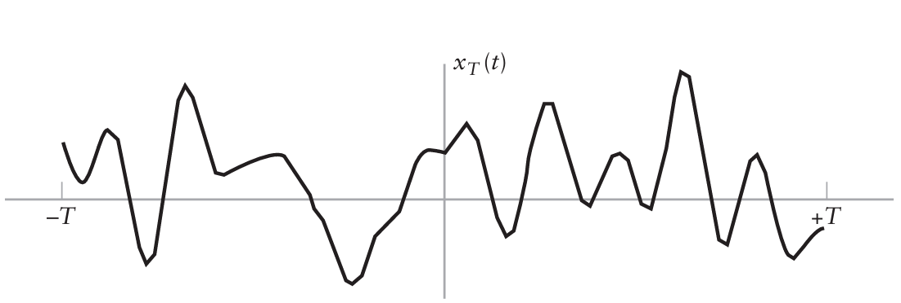

```{r setup, include=FALSE}
knitr::opts_chunk$set(echo = TRUE)
library(reticulate)
```

<p ALIGN=justify>Um sinal aleatório pode ser visto como pertencendo a uma família de sinais, gerado por algum mecanismo probabilístico. Logo, nenhum par de sinais exibe as mesmas variações no tempo. Seja $x(t)$ uma função amostra do processo aleatório $X(t)$. A Figura 8.17 mostra um gráfico da forma de onda de $x_T(t)$ no intervalo $–T < t < T$. Podemos definir a transformada de Fourier da função amostra $x_T (t)$ como:</p>

$$\xi _T(f) = \int_{-\infty}^{\infty} X_T(t)\exp{(-j2\pi ft)} \; dt \tag{8.78} $$
 
<p ALIGN=justify>Esta transformada converte a função amostra $x_T (t)$ em uma nova função amostra $\xi_T (f)$. Definimos a coleção (família) de todas estas novas funções amostra como o novo processo aleatório $\Xi_T (f)$. Efetivamente, a transformada de Fourier converteu a família de variáveis aleatórias $X(t)$ indexadas pelo parâmetro $t$ para uma nova família de variáveis aleatórias $\Xi_T (f)$ indexadas pelo parâmetro $f$.</p>

<figure>

<center></center>

<center>

<figcaption><br>Figura 8.17 - Função amostra de um processo aleatório.<br><br></figcaption>

</center>

</figure>

<p ALIGN=justify>Da discussão do Capítulo 2, lembramos que a densidade espectral de potência da função amostra $x(t)$ no intervalo $–T < t < T$ é $| \xi_T (f)|^2/2T$, na qual $\xi_T (f)$ é a transformada de Fourier de $x_T (t)$. Esta densidade espectral de potência irá depender da função amostra $x(t)$ particular retirada do espaço amostral. Desta forma, para obter a densidade espectral de potência de um processo aleatório, devemos executar uma operação de média de espaço amostral e, então, calcular o limite quando $T$ tende ao infinito.</p>
 
<p ALIGN=justify>A operação de média do espaço amostral requer a utilização da distribuição de probabilidade do espaço. O valor de $f$ é mantido fixo, enquanto calculamos a média para a família. Para a discussão atual, é suficiente saber que a operação de média no espaço amostral é realizada utilizando o operador $\mathbf{E}$, de esperança. Portanto, escrevemos o valor da média da família do novo processo aleatório $|\Xi_T (f)|^2$ como sendo $E[|\Xi_T (f)|^2]$ e a densidade espectral de potência correspondente do processo aleatório $X(t)$ como sendo</p>

$$S_x(f)=\lim_{T\rightarrow \infty} \frac{1}{2T}\mathbf{E}[|\Xi_T(f)|^2] \tag{8.79}$$

<p ALIGN=justify>É importante notar que na Equação (8.79), a média no espaço amostral deve ser calculada antes do limite ser determinado. O fato do processo ser estacionário em sentido amplo também é crítico para esta definição.</p>

<p ALIGN=justify>Esta abordagem de determinação da densidade espectral de potência através da média do espaço amostral pode ser utilizada para motivar um estimador da densidade espectral de potência dada uma função amostra de um processo estacionário ergódico. Na Seção 2.10, vimos como a transformada discreta de Fourier (TDF) pode ser utilizada para aproximar numericamente a transformada de Fourier. Em particular, se $\{x_n : n = 0, 1, ..., N – 1\}$ são amostras uniformemente espaçadas de uma função x(t) para t = nTs , então a transformada discreta de Fourier é definida por</p>

$$\xi_k=\sum^{N-1}_{n=0}x_nW^{kn} \tag{8.80}$$

<p ALIGN=justify>Na qual $W = \exp(–j2π/N)$ e $\{\xi_k\}$ são amostras do domínio da frequência em $f = k/NT_s$. Consequentemente, podemos estimar a densidade espectral de potência de um processo aleatório seguindo três passos:</p>

1. Particionar a função amostra $x(t)$ em $M$ seções de tamanho $NT_s$ e amostrá-las em intervalos $T_s$.

2. Executar a TDF em cada seção de tamanho $NT_s$ . Seja $\{\xi_{k – mN}\}$, $m = 0 ..., M – 1$, a representação de $M$ saídas da TDF, um conjunto para cada seção.

3. Calcular a média do quadrado da amplitude de cada TDF e, então, a estimativa da densidade espectral de potência será dada por:

\begin{align*}
\hat{S}_X(\frac{k}{NT_S})&= \frac{1}{M}\sum^{M-1}_{m=0}|\xi_{k+mN}|^2\\
&= \frac{1}{M}\sum^{M-1}_{m=0}\left|\sum^{N-1}_{n=0}x_{n+mN}W^{kn}\right|^2, \; k=0,...,M-1 \tag{8.81}
\end{align*}

<p ALIGN=justify>Este resultado é baseado, claramente, na consideração do processo ser ergódico.</p>

# Propriedades da densidade espectral de potência

<p ALIGN=justify>A densidade espectral de potência $S_X (f)$ e a função de autocorrelação $R_X (\tau)$ de um processo aleatório estacionário em sentido amplo formam um par transformada de Fourier nas variáveis $f$ e $\tau$. Em particular, as mesmas relações de Weiner-Khintchine aplicadas a processos determinísticos também relacionam a densidade espectral de potência e a função de autocorrelação de um processo aleatório, como mostrado por:</p>

$$S_X(f)=\int_{-\infty}^{\infty}R_X(\tau)\exp{(-j2\pi f\tau)} \; d\tau \tag{8.82}$$
e
$$R_X(f)=\int_{-\infty}^{\infty}S_X(\tau)\exp{(-j2\pi f\tau)} \; df \tag{8.82}$$
<p ALIGN=justify>As Equação (8.82) e Equação (8.83) são as relações básicas da teoria de análise espectral de processos aleatórios. As relações de Weiner-Khintchine mostram que se a autocorrelação ou a densidade espectral de potência de um processo aleatório for conhecida, a outra pode ser 
exatamente determinada.</p>

<p ALIGN=justify>Podemos utilizar este par de relações para obter algumas propriedades genéricas da densidade espectral de potência de um processo estacionário em sentido amplo.</p>

>**PROPRIEDADE 1 – VALOR MÉDIO QUADRÁTICO** O valor médio quadrático de um processo estacionário é igual à área total sob o gráfico da densidade espectral de potência, ou seja,

$$\mathbf{E}[|X(t)|^2]=\int^{\infty}_{-\infty}S_X(f)\;df \tag{8.84}$$

<p ALIGN=justify> Esta propriedade é obtida diretamente da Equação (8.83) fazendo $\tau = 0$ e observando que</p>

>**PROPRIEDADE 2 – NÃO NEGATIVIDADE** A densidade espectral de potência de um processo aleatório estacionário é sempre não negativa, ou seja,

$$S_X(f) \geq 0, \; \textrm{para todo }f\tag{8.85}$$

<p ALIGN=justify> Esta propriedade é obtida da definição de densidade espectral de potência dada pela Eq. (8.79).</p>

>**PROPRIEDADE 3 – SIMETRIA** A densidade espectral de potência de um processo aleatório real é uma função par da frequência, ou seja,

$$S_X(-f)=S_X(f)\tag{8.86}$$

<p ALIGN=justify> Esta propriedade é facilmente obtida substituindo, primeiro, –f por $f$ na Equação (8.82).</p>

$$S_X(-f)=\int^{\infty}_{-\infty}R_X(\tau)\exp{(j2\pi f\tau)}\; d\tau$$

<p ALIGN=justify>A seguir, substituindo $-\tau$ por $\tau$ e percebendo que $R_X (–\tau) = R_X (\tau)$ para todo processo real, obtemos:</p>

$$S_X(-f)=\int^{\infty}_{-\infty}R_X(\tau)\exp{(j2\pi f\tau)}\; d\tau=S_X(f)$$

<p ALIGN=justify>O qual é o resultado desejado.</p>

>**PROPRIEDADE 4 – PROCESSOS ALEATÓRIOS FILTRADOS** Se um processo aleatório estacionário $X(t)$ com espectro $S_X (f)$ for passado através de um filtro linear com resposta em frequência $H(f)$, o espectro do processo aleatório estacionário de saída $Y(t)$ é dado por:

$$S_Y(f)=|H(f)|^2S_x(f) \tag{8.87}$$

<p ALIGN=justify>Este resultado é análogo ao obtido para sinais determinísticos.</p>

# [Volta a Página Inicial 🏠](Página-Inicial.html)