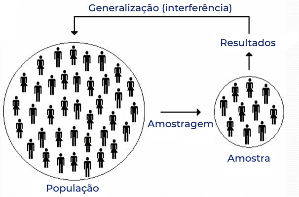

```{r setup, include=FALSE}
knitr::opts_chunk$set(echo = TRUE)
library(reticulate)
```

```{python include=FALSE}

import numpy as np
import matplotlib.pyplot  as plt

```


# 1. População e Amostra

## 1.1 Variáveis

<p ALIGN=justify> Chamamos de variável o conjunto de resultados possíveis de um fenômeno, geralmente representadas por uma letra maiuscula como X, Y, Z... podendo assumir qualquer valor de um conjunto de dados, Podemos citar como exemplo: idade, sexo, estado civil etc. As variaveis aleatórias podem ser divididas em duas partes, quanto a analise de informações das mesmas, sendo elas qualitativas e quantitativa.</p>

**1. Qualitativas:** A mesma representa informações que não podem ser medidas de forma numéricas sendo elas também dividas entre:

>**Nominal:** quando temos a representação por atributo, como por exemplo: sexo, graduação, nacionalidade e etc.
 
>**Ordinais ou por postos:** quando a variavel segue uma ordem mesmo não podendo ser medida, como por exemplo: patente militar, cargos em uma empresa e etc.

**2. Quantitativas:** quando os valores da variável forem expressos em números.

>**Discreto:** assume apenas valores pertencentes a um conjunto enumerável e resultam de uma contagem. Ex: número de filhos quantidade de cursos etc.
 
>**Continuo:**  pode assumir qualquer valor num intervalo razoável de variação. Ex: peso, altura, faixa etária etc.

## 1.2 População 

<p ALIGN = justify> É um conjunto de elementos com pelo menos uma característica em comum, 
que deve delimitar inequivocamente quais os elementos pertencem à população e quais não pertencem. Exemplos: os alunos de uma universidade, os clientes de um banco.</p>

>Como definir uma população?

>A quem interessa esse resultado

<p ALIGN = justify >Se o analista dos resultados for o responsável pelos cursos de educação a distância de uma universidade, será que interessa a ele o desempenho dos alunos dos cursos presenciais?</p>

>Devemos procurar as características que interessam ao analista dos resultados.

>Os alunos de uma universidade em 2010.

>Os alunos dos cursos a distância da universidade em 2010.

<p ALIGN = justify >Perceba que a cada item, estamos especificando cada vez mais as características das pessoas a serem observadas, restringindo a população objeto de nossos estudos.</p>

<p ALIGN = justify >A população pode ser:</p>

>**Finita:** quando o número de unidades a observar pode ser contado e é limitado. Ex: alunos matriculados nas escolas públicas, pessoas que possuem aparelho telefone celular, número de alunos que se matricularam na disciplina “Estatística” na universidade em 2010 etc.

>**Infinita:** quando a quantidade de observação é ilimitada ou quando as unidades da população não podem ser contadas. Ex: conjunto de medidas de determinado comprimento, gases, líquidos, em que as unidades não podem ser identificadas ou contadas.

## 1.3 Censo

<p ALIGN = justify>É uma coleção de dados relativos a todos os elementos de uma população.</p>

## 1.4 Amostra

<p ALIGN = justify>Definida as características da população, o passo seguinte é o levantamento de dados acerca das características do objeto em estudo. Mas será que sempre é 
possível o levantamento de dados de toda a população que devemos analisar? A maioria das vezes não é conveniente e em algumas é impossível devido aos seguintes fatores:</p>

* Tempo: as informações devem ser obtidas com rapidez.

* Precisão: as informações devem ser corretas.

* Custo: no processo de coleta, sistematização, análise e interpretação, o 
custo deve ser o menor possível.

<p ALIGN = justify>Por impossibilidade ou inviabilidade econômica ou temporal, devemos então, delimitar nossas observações a uma parte da população, isto é, a uma amostra proveniente dessa população.</p>

<figure>

<center></center>

<center>

<figcaption><br>Figura 1 - Exemplo de amostragem.<br><br></figcaption>

</center>

</figure>

<p ALIGN = justify>Amostragem é uma técnica especial usada para recolher amostras que garante o acaso na escolha de modo a garantir à amostra o caráter de representatividade. Vejamos três dos principais tipos de amostragem.</p>

* **Amostragem casual simples:** composta de elementos retirados ao acaso da população, ou seja, consiste em selecionar a amostra através de um sorteio. Dessa maneira, todos os elementos da população terão igual probabilidade de serem escolhidos. Para realizar esse sorteio, podemos utilizar urnas, tabelas de números aleatórios ou algum software que gere números aleatórios. 

* **Amostragem sistemática:** É utilizada quando a população está naturalmente ordenada, como listas telefônicas, fichas de cadastramento etc.

* **Amostragem estratificada:** composta por elementos provenientes da divisão da população em subgrupos denominados estratos (por exemplo, por sexo, renda, bairro etc).

# 2. Gráficos Estatísticos

## 2.1 Apresentação Gráfica 

<p ALIGN=justify> Os dados podem ser apresentados em gráficos, com a finalidade de proporcionar ao interessado uma visão rápida do comportamento do fenômeno. Representa qualquer tabela de maneira simples, legível e interessante, tornando claras as informações que poderiam passar despercebidos em dados apenas tabulados. É importante que os gráficos sejam simples; as informações contidas devem ser diretas, e detalhes secundários, omitidos, devem ser claros para possibilitar uma correta interpretação e devem expressar a verdade sobre o caso em estudo. Os principais tipos de gráficos são os diagramas, os cartogramas e os pictogramas.</p>

## 2.2 Diagramas

<p ALIGN=justify>Os diagramas são gráficos geométricos que possuem no máximo duas dimensões. O sistema cartesiano é utilizado na sua construção.</p>

### 2.2.1 Gráficos em Barra ou Colunas

<p ALIGN=justify> Um gráfico em barras horizontais representa a série de dados através de retângulos dispostos horizontalmente com mesma altura e comprimentos proporcionais à frequência de cada dado. Esse gráfico é muito apropriado para representar graficamente os dados qualitativos, porém pode, ser utilizado também para representar dados quantitativos discretos.</p>

<p ALIGN= justify>Exemplo 1: Vamos considerar a criação de um grafico de barras horizontais e verticais que representaram o numero de vendas realizadas pelos vendedores A, B, C, D e E, em um mês.</p>

```{python, fig.align='center', fig.width=6, fig.height=5}
def plot_grafico_barras_verticais(dados, titulos_eixo_x, titulo_grafico):
    # Configuração dos dados
    quantidade_barras = len(dados)
    posicoes_barras = range(quantidade_barras)

    # Criação do gráfico
    plt.bar(posicoes_barras, dados, align='center', alpha=0.7)
    plt.xticks(posicoes_barras, titulos_eixo_x)
    plt.ylabel('Numero de vendas')
    plt.title(titulo_grafico)

    # Exibição do gráfico
    plt.show()

# Exemplo de dados
dados = [10, 24, 15, 8, 12]
titulos_eixo_x = ['A', 'B', 'C', 'D', 'E']
titulo_grafico = 'Figura 1: Vendas ao mês por vendedor'

# Chamada da função para plotar o gráfico
plot_grafico_barras_verticais(dados, titulos_eixo_x, titulo_grafico)
```

```{python, fig.align='center', fig.width=6, fig.height=5}
def plot_grafico_barras_invertido(dados, titulos_eixo_y, titulo_grafico):
    # Configuração dos dados
    quantidade_barras = len(dados)
    posicoes_barras = range(quantidade_barras)

    # Criação do gráfico de barras horizontais
    plt.barh(posicoes_barras, dados, align='center', alpha=0.7)
    plt.yticks(posicoes_barras, titulos_eixo_y)
    plt.xlabel('Numero de vendas')
    plt.title(titulo_grafico)

    # Exibição do gráfico
    plt.show()

# Exemplo de dados
dados = [10, 24, 15, 8, 12]
titulos_eixo_y = ['A', 'B', 'C', 'D', 'E']
titulo_grafico = 'Figura 2: Vendas ao mês por vendedor'

# Chamada da função para plotar o gráfico de barras horizontais
plot_grafico_barras_invertido(dados, titulos_eixo_y, titulo_grafico)
```


<p ALIGN= justify>Exemplo 2: A representação em gráfico de pizza da distribuição de frutas em termos percentuais.</p>

```{python, fig.align='center', fig.width=6, fig.height=5}
# Dados
rotulos = ['Maçãs', 'Laranjas', 'Bananas', 'Uvas', 'Figos']
tamanhos = [25, 30, 20, 25, 27]
cores = ['red', 'orange', 'yellow', 'blue', 'purple']

# Criar figura e eixos
fig, ax = plt.subplots();

# Criar um gráfico de pizza
ax.pie(tamanhos, labels=rotulos, colors=cores, autopct='%1.1f%%');

# Adicionar título
ax.set_title('Distribuição das Frutas');

# Mostrar o gráfico plotado
plt.show()
```


<p ALIGN = justify>Exemplo 3: Gráfico em linhas da cotação diaria dos valores de ações de grandes empresas nacionais.</p>

```{python, fig.align='center', fig.width=6, fig.height=5}

# Dados (cotações diárias das ações)
dias = list(range(1, 13))
vale5 = [82.2, 79.2, 84.0, 86.4, 84.8, 87.2, 88.8, 92.0, 89.6, 92.8, 95.2, 93.6]
unip6 = [75.0, 73.2, 75.6, 77.4, 78.2, 76.8, 78.0, 81.0, 82.2, 83.6, 83.4, 82.2]
bbas3 = [28.3, 27.9, 28.5, 29.2, 29.0, 29.4, 29.7, 30.1, 29.8, 30.2, 30.5, 30.3]

# Criar figura e eixos
fig, ax = plt.subplots();

# Plotar os dados
ax.plot(dias, vale5, label='VALE5');
ax.plot(dias, unip6, label='UNIP6');
ax.plot(dias, bbas3, label='BBAS3');

# Mostrar os rótulos dos eixos e a legenda do gráfico
ax.set_xlabel('Dia');
ax.set_ylabel('Preço (R$)');
ax.legend();

# Exibir o gráfico pronto
plt.show()
```


<p ALIGN=justify>Exemplo 4: Gráfico polar com representação de dados pluviométricos em cada mês do ano.</p>

```{python, fig.align='center', fig.width=6, fig.height=5}
import matplotlib.pyplot as plt
import numpy as np

def plot_grafico_polar_precipitacao_fluviometrica():
    # Dados fictícios de precipitação fluvial média em cada mês do ano (em milímetros)
    meses = ['Jan', 'Fev', 'Mar', 'Abr', 'Mai', 'Jun', 'Jul', 'Ago', 'Set', 'Out', 'Nov', 'Dez']
    precipitacao_media = [100, 80, 110, 150, 200, 250, 300, 280, 220, 180, 120, 90]

    # Convertendo os ângulos para radianos
    angulos = np.linspace(0, 2*np.pi, len(meses), endpoint=False)

    # Criação do gráfico polar
    fig = plt.figure();
    ax = fig.add_subplot(1, 1, 1, projection='polar');
    ax.plot(angulos, precipitacao_media, marker='o', linestyle='-', color='b');

    # Configuração dos ângulos do gráfico polar
    ax.set_thetamin(0);
    ax.set_thetamax(360);
    ax.set_theta_zero_location("N");
    ax.set_theta_direction(-1);

    # Configuração das legendas
    ax.set_xticks(angulos);
    ax.set_xticklabels(meses);

    # Exibição do gráfico
    plt.title('Precipitação Fluvial Média em Cada Mês do Ano');
    plt.show()

# Chamada da função para plotar o gráfico polar com precipitação fluviométrica
plot_grafico_polar_precipitacao_fluviometrica()
```

# 3. Distribuição de Frequência

## 3.1 Sintetizando dados qualitativos

<p ALIGN=justify > Os dados qualitativos são o resultado da análise de variáveis qualitativas. A análise estatística desse tipo de dados resume-se à contagem do número de indivíduos em cada categoria e ao cálculo das respectivas porcentagens.</p>

<p ALIGN=justify> No exemplo abaixo podemos considerar uma tabela que representa o numero de compras de refrigerantes de acordo com cada marca, aonde temos que as marcas incidentes estão alocados em uma matriz, mostrada no código abaixo. O código gera aleatoriamente o numero de refrigerantes em cada celula da matriz. Depois devemos agora fazer um contador aonde seja possivel verificar o numero de incidencia de cada marca de refrigerante alocados na matriz.</p>

```{python, fig.align='center', fig.width=6, fig.height=6}
import random
from collections import Counter

# Lista com as marcas de refrigerante
marcas_refrigerante = ["coca cola", "pepsi", "guarana", "fanta", "okey"]

# Definir o tamanho da matriz
tamanho_matriz = 5

# Criar uma matriz vazia
matriz = [[None for _ in range(tamanho_matriz)] for _ in range(tamanho_matriz)]

# Preencher a matriz com as marcas de refrigerante usando random.choices()
for i in range(tamanho_matriz):
    for j in range(tamanho_matriz):
        matriz[i][j] = random.choice(marcas_refrigerante)

# Contar a ocorrência de cada refrigerante na matriz usando Counter do módulo collections
contagem_refrigerantes = Counter([refrigerante for linha in matriz for refrigerante in linha])

# Criar duas listas a partir do dicionário: uma com os nomes dos refrigerantes e outra com as contagens
nomes_refrigerantes = list(contagem_refrigerantes.keys())
quantidades_refrigerantes = list(contagem_refrigerantes.values())

# Criar o gráfico de barras
plt.bar(nomes_refrigerantes, quantidades_refrigerantes);

# Adicionar rótulos aos eixos
plt.xlabel('Refrigerante');
plt.ylabel('Quantidade');

# Adicionar título ao gráfico
plt.title('Quantidade de cada refrigerante na matriz');

# Rotacionar os rótulos do eixo x para melhor visualização
plt.xticks(rotation=45);

# Exibir o gráfico
plt.show()
```


<p ALIGN=justify>Agora podemos enfim representar esses dados em termos estatiscos sendo o numero de incidencias de uma marca na matriz o valor absoluto ou frequência absoluta de um evento e a frequência relativa é dada em termos da relação entre a incidencia de um determinado numero de ocorencias de uma marca sobre o valor total de compras de todas as marcas.</p>

$$ F_a = N_a \tag{4.1}$$

<p ALIGN=justify>Aonde $F_a$ representa a frequência absoluta  e $N_a$ o numero de ocorrências do evento. A frequência relativa é calculada de acordo com a Equação $(4.2)$.

$$F_r = \frac{N_a}{N_{total}} \tag{4.2}$$

<p ALIGN=justify>Onde temos que $F_r$ é a frequência relativa e $N_{total}$ o numero total de compras de refrigerante.</p>

```{python echo=FALSE}
print("Marcas:",nomes_refrigerantes )
print("Quantidade",quantidades_refrigerantes)
print("Marca:",nomes_refrigerantes[0] ,",","Frequência Absoluta:",quantidades_refrigerantes[0])
print("Marca:",nomes_refrigerantes[1] ,",","Frequência Absoluta:",quantidades_refrigerantes[1])
print("Marca:",nomes_refrigerantes[2] ,",","Frequência Absoluta:",quantidades_refrigerantes[2])
print("Marca:",nomes_refrigerantes[3] ,",","Frequência Absoluta:",quantidades_refrigerantes[3])
print("Marca:",nomes_refrigerantes[4] ,",","Frequência Absoluta:",quantidades_refrigerantes[4])
```

```{python echo=FALSE}
quantidade_total = sum(quantidades_refrigerantes)
print('quantidade total de refrigerantes:', quantidade_total)    
print("Marca:",nomes_refrigerantes[0] ,",","Frequência Relativa:",round(quantidades_refrigerantes[0]/quantidade_total,3))
print("Marca:",nomes_refrigerantes[1] ,",","Frequência Relativa:",round(quantidades_refrigerantes[1]/quantidade_total,3))
print("Marca:",nomes_refrigerantes[2] ,",","Frequência Relativa:",round(quantidades_refrigerantes[2]/quantidade_total,3))
print("Marca:",nomes_refrigerantes[3] ,",","Frequência Relativa:",round(quantidades_refrigerantes[3]/quantidade_total,3))
print("Marca:",nomes_refrigerantes[4] ,",","Frequência Relativa:",round(quantidades_refrigerantes[4]/quantidade_total,3))
```


# Referências

[1] Silva, L.C *et al*. **Matemática Estatística e Probabilidade**, CAPES. Disponivel em : [eduCAPES](https://educapes.capes.gov.br/bitstream/capes/554261/2/Livro%20Estatistica%20e%20Probabilidade%20.pdf)

[2] Documentação da biblioteca [Scipy.static](https://docs.scipy.org/doc/scipy/reference/stats.html)

[3] Documentação da biblioteca [Sympy](https://docs.sympy.org/latest/index.html)

[4] Documentação da biblioteca [Numpy](https://numpy.org/doc/)


# [Volta a Página Inicial 🏠](Página-Inicial.html)


