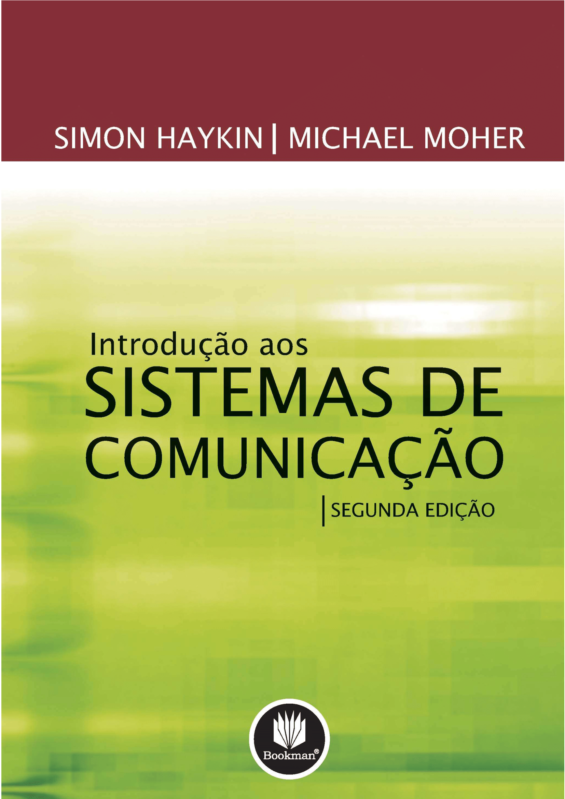

```{r setup, include=FALSE}
knitr::opts_chunk$set(echo = TRUE)
library(reticulate)
```

# Seja Bem-Vindo!

<p ALIGN = justify>Bem-vindo à página da disciplina de Probabilidade e Processos Estocásticos! Aqui, exploraremos os conceitos fundamentais apresentados no Capítulo 8 - Sinais e Ruídos Aleatórios, do livro "Introdução aos Sistemas de Comunicação" (segunda edição), de Simon Haykin e Michael Moher.</p>

<p ALIGN = justify>Esta plataforma foi criada para fornecer recursos e informações essenciais para o estudo dessa disciplina, baseada em uma abordagem consagrada na literatura de sistemas de comunicação. O capítulo em destaque é uma peça central para compreender as nuances dos sinais aleatórios, um elemento crítico em diversas aplicações práticas.</p>

<p ALIGN = justify>Ao longo do curso, examinaremos propriedades essenciais, aprofundando-nos nas características estocásticas dos processos envolvidos em sistemas de comunicação. Este material é projetado para oferecer uma compreensão sólida, respaldada pela autoridade do livro-texto utilizado.</p>

# Livro Texto Utilizado

<figure>

<center></center>

<center>

<figcaption><br>Figura 1 - Capa do livro.<br><br></figcaption>

</center>

</figure>

<p ALIGN = justify>Introdução aos sistemas de comunicação, 2.ed. é mais uma obra do mestre Simon Haykin, com co-autoria de Michael Moher. Dada a natureza altamente matemática da teoria da comunicação, é muito fácil o aluno esquecer o lado prático dos sistemas de comunicação. Para evitar isso, os autores tiveram o cuidado de transitar entre a abordagem matemática adequada e a relevância prática da teoria sempre que apropriado. O texto tem uma linguagem acessível e precisa e está organizado de forma a ser flexível para a organização do material em cursos de acordo com os interesses dos professores e alunos.</p>

# Capítulos Abordados

<p ALIGN=justify>Os capítulos que serão estudados durante o curso serão os seguintes:</p>

>[Introdução - Noções de Estatística](Introdução.html)

>[Capítulo 8.1 - Probabilidade e Váriaveis Aleatórias](Capítulo-8.1.html)

>[Capítulo 8.2 - Esperança](Capítulo-8.2.html)

>[Capítulo 8.3 - Transformação de Variáveis Aleatórias](Capítulo-8.3.html)

>[Capítulo 8.4 - Váriaveis Aleatórias Gaussianas](Capítulo-8.4.html)

>[Capítulo 8.5 - Teorema do Limite Central](Capítulo-8.5.html)

>[Capítulo 8.6 - Processos Aleatórios](Capítulo-8.6.html)

>[Capítulo 8.7 - Correlação de Processos Aleatórios](Capítulo-8.7.html)

>[Capítulo 8.8 - Espectro de Sinais Aleatórios](Capítulo-8.8.html)

>[Capítulo 8.9 - Processos Gaussianos](Capítulo-8.9.html)

>[Capítulo 8.10 - Ruído Branco](Capítulo-8.10.html)

>[Capítulo 8.11 - Ruído de Faixa Estreita](Capítulo-8.11.html)


# Organização da Disciplina

<p ALIGN=justify>A distribuição do curso de Probabilidade e Processos Estocásticos será da seguinte forma:</p>

### Semana 1-2: Introdução e Conceitos Básicos (4 aulas)

**Aula 1-2 (2 aulas):** Boas-vindas, apresentação do curso, objetivos e revisão do conteúdo programático.

**Aula 3 (2 aulas):** Revisão de conceitos básicos de probabilidade, eventos e espaço amostral.

### Semana 3-4: Variáveis Aleatórias (4 aulas)

**Aula 4-5 (2 aulas):** Variáveis aleatórias discretas: definições, propriedades e distribuições comuns.

**Aula 6-7 (2 aulas):** Variáveis aleatórias contínuas: funções de densidade, distribuições e propriedades.

### Semana 5-6: Funções de Distribuição e Momentos (4 aulas)

**Aula 8-9 (2 aulas):** Funções de distribuição cumulativa e suas propriedades.

**Aula 10-11 (2 aulas):** Momentos de variáveis aleatórias: média, variância, skewness e kurtosis.

### Semana 7-8: Processos Estocásticos (6 aulas)

**Aula 12-13 (3 aulas):** Introdução a processos estocásticos: definições e classificações.

**Aula 14-15 (3 aulas):** Processos estocásticos estacionários e não estacionários.

### Semana 9-10: Análise de Sinais Aleatórios (6 aulas)

**Aula 16-17 (3 aulas):** Caracterização de sinais aleatórios: funções de autocorrelação e autocovariância.

**Aula 18-19 (3 aulas):** Teorema de Wiener-Khinchin e densidade espectral de potência.

### Semana 11-12: Processos Estocásticos em Sistemas de Comunicação (6 aulas)

**Aula 20-21 (3 aulas):** Introdução aos sistemas de comunicação e modelagem estocástica.

**Aula 22-23 (3 aulas):** Aplicações práticas em sistemas de comunicação.

### Semana 13: Revisão e Aplicações (3 aulas)

**Aula 24 (3 aulas):** Revisão do conteúdo, resolução de problemas e aplicações práticas.

### Semana 14: Avaliação e Encerramento (2 aulas)

**Aula 25 (2 aulas):** Avaliação final, revisão de conceitos-chave e encerramento do curso.

<p ALIGN=justify>Esta distribuição permite cobrir o conteúdo de forma eficaz, respeitando o tempo limitado das aulas. Adaptar as atividades para tornar as aulas interativas e incluir momentos de aplicação prática pode ser benéfico para o engajamento dos alunos.</p>

# Avaliação

<p ALIGN=justify>A avaliação em uma disciplina de Probabilidade e Processos Estocásticos pode ser projetada para medir a compreensão dos alunos em relação aos conceitos teóricos e sua capacidade de aplicar esses conhecimentos em situações práticas. Aqui estão algumas sugestões para componentes de avaliação:</p>

**1. Provas Teóricas:**

<p ALIGN=justify>Duas ou três avaliações teóricas ao longo do curso, cobrindo os conceitos fundamentais de probabilidade, variáveis aleatórias, processos estocásticos, análise de sinais aleatórios e aplicações em sistemas de comunicação.</p>

<p ALIGN=justify>Perguntas podem incluir cálculos de probabilidades, derivadas e integrais relacionadas a variáveis aleatórias, interpretação de resultados e demonstração de compreensão dos teoremas e conceitos fundamentais.</p>

**2. Trabalho Prático ou Projeto:**

<p ALIGN=justify>Um projeto ou trabalho prático que envolve a aplicação de conceitos aprendidos em situações do mundo real ou simulações relacionadas a sistemas de comunicação. Os alunos podem ser avaliados com base na precisão das análises, interpretação de resultados e na capacidade de comunicar eficazmente suas descobertas.</p>

**3. Participação em Aula:**

<p ALIGN=justify>Avaliação da participação ativa dos alunos durante as aulas, seja por meio de perguntas, discussões ou resolução de problemas em sala. Podem ser atribuídos pontos para contribuições construtivas e perguntas que demonstrem a compreensão dos tópicos discutidos.</p>

**4. Provas de Resolução de Problemas:**

<p ALIGN=justify>Avaliações específicas focadas na resolução de problemas práticos relacionados a sinais aleatórios, processos estocásticos e suas aplicações. Os alunos podem ser desafiados a aplicar fórmulas, interpretar resultados e resolver problemas práticos do mundo real.</p>

**5. Avaliação Contínua:**

<p ALIGN=justify>Avaliação ao longo do curso com base em tarefas de casa, exercícios práticos, quizzes curtos e discussões online. Isso pode incentivar a consistência no estudo e fornecer feedback regular sobre o desempenho dos alunos.</p>

<p ALIGN=justify>Ao diversificar os métodos de avaliação, é possível abordar diferentes estilos de aprendizado e garantir uma avaliação justa e abrangente dos conhecimentos adquiridos ao longo da disciplina. Além disso, é fundamental fornecer feedback construtivo para ajudar os alunos no desenvolvimento contínuo de suas habilidades e conhecimentos.</p>

# Referências e Downloads

[HAYKIN, Simon; MOHER, Michael. **Introdução aos sistemas de comunicação**. Bookman Editora, 2009.](LT)